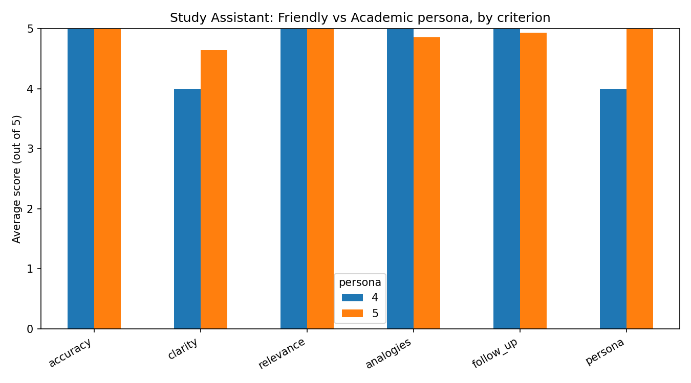

# LLM Evaluation Framework — Study Assistant

An end-to-end evaluation pipeline for benchmarking AI persona responses across multiple quality dimensions, combining a custom LLM-as-judge scorer with DeepEval's automated metrics for cross-validation.

## Overview

This project evaluates a "Study Assistant" chatbot that answers ML/AI questions in two different personas — **Friendly** and **Academic** — and scores each response along 6 quality criteria using two independent judging methods. The goal is not just to score responses, but to check whether a manual LLM-as-judge and an automated metric framework (DeepEval) actually *agree* with each other.

## Why This Exists

Most single-method eval setups trust one judge's score at face value. This framework was built to answer a more useful question: **does a hand-written judging prompt agree with an established, automated evaluation library?** If they disagree often, that's a signal the manual judge (or the automated one) is unreliable. If they agree, you can trust either one going forward with more confidence.

## Architecture

```
Question + Persona
        │
        ▼
  Study Assistant (Groq, Llama 3.1-8b-instant)
        │
        ▼
   AI Response
        │
   ┌────┴─────┐
   ▼          ▼
Manual Judge   DeepEval Metrics
(Groq,        (AnswerRelevancyMetric,
Llama 3.3-70b) GEval — Accuracy)
   │              │
   └──────┬───────┘
          ▼
   Aggregated Results (CSV)
          │
          ▼
 Summary Stats + Persona Comparison Chart
```

## Test Dataset

- **10 questions** spanning `easy` / `medium` / `hard` difficulty (e.g., "What are LLMs?" → "Explain the attention mechanism in transformers")
- **2 personas** — Friendly (encouraging, beginner-facing) and Academic (formal, precise)
- **20 total test cases** (10 questions × 2 personas) by design

## Scoring Methods

### 1. Manual LLM-as-Judge
A Groq-hosted judge model (`llama-3.3-70b-versatile`) scores each response 1–5 on:
- Accuracy
- Clarity
- Relevance
- Use of Analogies
- Follow-up Question
- Persona Consistency

### 2. DeepEval Automated Metrics
- **`AnswerRelevancyMetric`** — does the response actually address the question?
- **`GEval` (Accuracy)** — custom criteria-based scoring for factual correctness

Both DeepEval metrics run on a Groq-backed judge model (`GroqDeepEvalModel`) instead of Gemini, to avoid Gemini's tighter free-tier quota.

### 3. Cross-Method Agreement
The pipeline compares the manual judge's accuracy score (≥4 = "pass") against DeepEval's `GEval` pass/fail to compute an **agreement rate** — the core validation metric of this project.

## Engineering Decisions Worth Noting

- **Unified retry logic across two providers.** Groq and Gemini raise different exception types for the same underlying failures (rate limits, server overload) — `RateLimitError`/`APIStatusError` on Groq vs. `ClientError`/`ServerError` on Gemini. `call_with_retry()` normalizes handling for both with provider-appropriate backoff.
- **Key collision fix.** The manual judge's `PERSONA` score is stored under `persona_consistency`, explicitly kept separate from the `persona` field (Friendly/Academic label) to prevent one from silently overwriting the other in the results dict.
- **Per-case checkpointing.** Results are written to CSV after every single test case, not just at the end — a crash or rate limit mid-run doesn't cost you completed work.
- **JSON retry handling for DeepEval.** Groq occasionally returns malformed JSON where Gemini's structured output mode wouldn't — `run_deepeval()` retries a few times before failing, since regenerating usually fixes it.

## Results (Sample Run — 15/20 cases completed)

| Metric | Value |
|---|---|
| Avg. Accuracy | 5.00 / 5 |
| Avg. Clarity | 4.60 / 5 |
| Avg. Relevance | 5.00 / 5 |
| Avg. Analogies | 4.87 / 5 |
| Avg. Follow-up | 4.93 / 5 |
| Avg. Persona Consistency | 4.93 / 5 |
| DeepEval Relevancy Pass Rate | 93.3% |
| DeepEval Accuracy Pass Rate | 100% |
| Manual vs. GEval Agreement | 100% |

> Note: this run completed 15 of the 20 designed test cases before stopping (likely a rate limit). The checkpointing design means all 15 completed cases were saved regardless.

## Tech Stack

- **Language:** Python
- **LLM APIs:** Groq (Llama 3.1-8b-instant, Llama 3.3-70b-versatile), Gemini
- **Evaluation:** DeepEval (`AnswerRelevancyMetric`, `GEval`)
- **Data/Analysis:** pandas, matplotlib

## Project Structure

```
llm_eval_framework.py     # Full pipeline: assistant, judges, retry logic, aggregation
eval_results.csv          # Final results after a run
eval_results_partial.csv  # Live checkpoint file, updated after every test case
persona_comparison.png    # Bar chart: Friendly vs Academic across all 6 criteria
```

## Running It

```bash
pip install -U groq google-genai deepeval pandas matplotlib
python llm_eval_framework.py
```

Requires `GROQ_API_KEY` and `GEMINI_API_KEY` environment variables (or Colab secrets, as configured in the script).

## Possible Extensions

- Complete the remaining 5 test cases to get a full 20-case sample
- Add a third, independent judge to strengthen the cross-validation design
- Track cost/latency per API call alongside quality scores
- Expand the test set beyond ML/AI topics to check generalization



IMPORTANT:

Problems Practice:-
# LLM Evaluation Framework — Simple Explanation + Interview Prep

## 1. What is this project, in plain words?

Imagine you built a chatbot that answers study questions (like "What is machine learning?"). The chatbot can talk in two different styles — one **Friendly** (like an enthusiastic tutor) and one **Academic** (like a strict professor).

Now the problem is: **how do you know if the chatbot's answers are actually good?** You can't just "eyeball" 20 answers and guess.

So this project builds an **automatic grading system** for the chatbot. It:
1. Asks the chatbot 10 questions, in both personas (20 answers total)
2. Grades every answer using **two different graders**:
   - A grader you wrote yourself (asks another AI: "rate this answer 1-5 on accuracy, clarity, etc.")
   - A grader from a ready-made library called DeepEval
3. Checks if your grader and DeepEval's grader **agree** with each other
4. Saves everything to a spreadsheet (CSV) and makes a chart comparing the two personas

**Why two graders instead of one?** Because if you only trust one grader, you don't know if it's actually reliable. If two independent graders agree most of the time, you can trust the grading system a lot more.

---

## 2. The simplest possible summary (use this if asked "explain your project in 30 seconds")

> "I built a system that automatically tests how good an AI chatbot's answers are. Instead of trusting one AI grader, I used two different grading methods and checked if they agreed with each other — kind of like getting a second opinion from a doctor. I also made the system that survives crashes, so if it fails halfway through testing, it doesn't lose the work it already did."

---

## 3. Key words you should be comfortable explaining simply

| Term | Simple meaning |
|---|---|
| LLM | A large AI model that can understand and write text (like ChatGPT) |
| Persona | A "personality" or style the AI is told to talk in |
| LLM-as-judge | Using one AI to grade another AI's answer |
| DeepEval | A ready-made Python library that has pre-built ways to grade AI answers |
| API | A way for your code to "talk" to an AI service over the internet |
| Retry logic | Code that automatically tries again if something fails (like a bad internet connection) |
| Checkpointing | Saving your progress regularly, so you don't lose everything if it crashes |
| Rate limit | A service saying "you're asking too fast, slow down" (common with free AI APIs) |

---

## 4. Likely Interview Questions + Simple Answers

### Q1: "Walk me through your project."
**A:** "I built a chatbot that answers study questions in two personas — friendly and academic. Then I built an automatic grading system for it, using two independent methods: a custom grader I wrote, and a library called DeepEval. I compared the two graders to see if they agreed, which tells me if my grading is trustworthy."

---

### Q2: "Why did you use two graders instead of one?"
**A:** "If I only used one grader, I'd have no way to know if that grader itself was biased or wrong. By using two independent methods and checking if they agree, I can trust the result much more — similar to how you'd want a second doctor's opinion before trusting a diagnosis."

---

### Q3: "What happens if the AI service goes down or you hit a rate limit?"
**A:** "I wrote a retry function that catches those specific errors and waits before trying again, instead of crashing the whole program. I used two different AI providers — Groq and Gemini — and they each report errors differently, so I had to handle both error formats in one place."

---

### Q4: "What was the hardest bug you ran into?"
**A:** "I had a bug where my code was storing the AI's persona label (Friendly/Academic) and the persona *consistency score* under the same variable name by accident, so one was silently overwriting the other. I caught it by checking my saved results and noticing the numbers didn't make sense, then fixed it by giving each one its own clearly separate name."

*(This is a great answer because it shows you actually understand your own code and can debug — that's what interviewers want to hear.)*

---

### Q5: "How did you make sure you didn't lose your work if something crashed?"
**A:** "Instead of saving all my results only at the very end, I saved the results to a CSV file after every single test case finished. So even if the program crashed on test case 16 out of 20, I'd still have all 15 completed results saved safely."

---

### Q6: "What does 'LLM-as-judge' mean, and why is it useful?"
**A:** "It means using an AI model to grade another AI's output, instead of a human doing it. It's useful because grading 20 long text answers by hand is slow, but an AI can do it in seconds using a scoring prompt — I gave it clear criteria like accuracy, clarity, and whether it stayed in the right persona."

---

### Q7: "What metrics did you track, and what did you find?"
**A:** "I tracked 6 things: accuracy, clarity, relevance, use of analogies, whether it asked a follow-up question, and persona consistency. On my sample run, the average scores were very high — around 4.9-5 out of 5 on most — and my manual grader agreed with DeepEval's automated grader 100% of the time on the cases I completed."

*(Be ready for the follow-up: "how many cases?" — answer honestly: 15 out of the 20 the pipeline was designed for, because the run stopped early.)*

---

### Q8: "Why did only 15 out of 20 test cases complete?"
**A:** "The run likely stopped due to a rate limit from the free-tier API — these AI services limit how many requests you can send per minute. Because I built in checkpointing, I didn't lose the 15 that did complete, and I could resume from there if I ran it again."

*(This is actually a good answer — it shows you understand failure isn't the end of the world if you designed for it.)*

---

### Q9: "What would you improve if you had more time?"
**A:** "A few things: finish the remaining 5 test cases for a full 20-case sample, add a third independent grader to make the agreement check even stronger, and track things like cost and response time per API call, not just quality scores."

---

### Q10: "What's the difference between your manual judge and DeepEval's metrics?"
**A:** "My manual judge is a prompt I wrote myself that asks an AI to score 6 specific criteria I care about, like persona consistency. DeepEval's metrics are pre-built, tested scoring methods from an outside library — `AnswerRelevancyMetric` checks if the answer actually relates to the question, and `GEval` checks factual accuracy using a more structured scoring process. Using both gave me confidence my custom grader wasn't just making things up."

---

### Q11: "Why did you use two different AI providers (Groq and Gemini) instead of one?"
**A:** "Mainly to work around free-tier limits — if one provider's quota runs out, having code that also works with another provider gives more flexibility. It also meant I had to handle two different sets of error types in one retry system, which was a good exercise in writing more general, reusable code instead of code that only works for one specific API."

---

### Q12: "If your two graders disagreed a lot, what would that tell you?"
**A:** "It would mean I couldn't fully trust either grader on its own, and I'd need to investigate further — maybe my manual grading prompt wasn't clear enough, or DeepEval's criteria didn't match what I actually wanted to measure. Disagreement is actually useful information, not just a bad result — it tells you where to dig deeper."

---

## 5. A tip for the interview

If you get stuck on a technical detail, it's completely fine to say something like:
> "I'd need to check the exact code to give you the precise detail, but the general idea was..."

This is much better than guessing and getting caught in a wrong answer — interviewers respect honesty about the limits of memory far more than a made-up confident answer.
